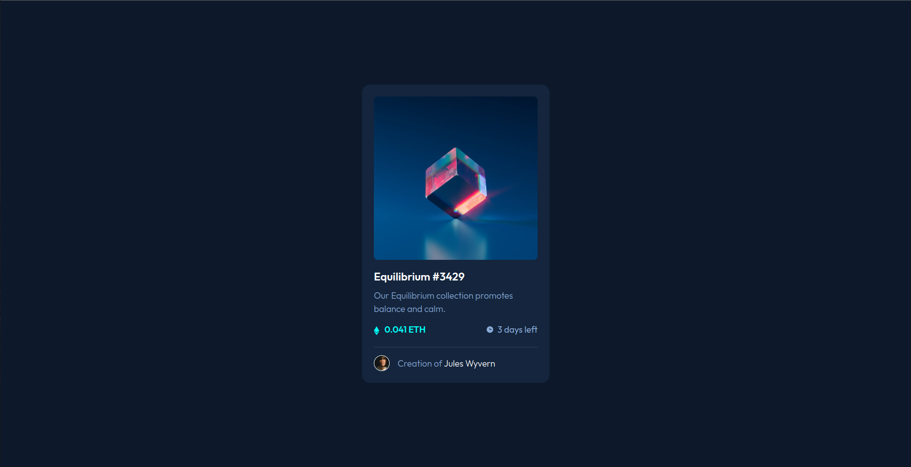

# NFT preview card component solution

This is a solution to the [NFT preview card component challenge on Frontend Mentor](https://www.frontendmentor.io/challenges/nft-preview-card-component-SbdUL_w0U).

## Overview

### The challenge

Users should be able to:

- View the optimal layout depending on their device's screen size
- See hover states for interactive elements

### Links

- Solution URL: [Add solution URL here](https://your-solution-url.com)
- Live Site URL: [Add live site URL here](https://your-live-site-url.com)

## My process

### Built with

- Semantic HTML5 markup
- CSS custom properties
- Flexbox
- Mobile-first workflow

### What I learned

- How to make overlay effect appear on a hover

```css
.hover-img {
  position: absolute;
  top: 0;
  left: 0;
  width: 100%;
  height: 100%;

  display: flex;
  justify-content: center;
  align-items: center;

  opacity: 0;
}

.hover-img:hover {
  opacity: 1;
  background-color: hsl(178, 100%, 50%, 0.5);
}
```

### Continued development

- Make hover effects as animations
